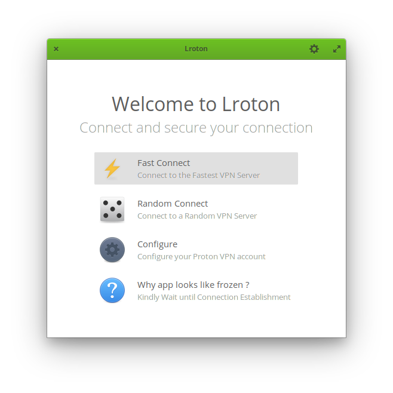

# Lroton

Simple , Minimal , Lightweight Vala GUI for Proton VPN for Elementary OS

[](https://github.com/RajSolai/lroton/issues)

[](https://GitHub.com/RajSolai/lroton/releases/)

<a id="raw-url" href="https://github.com/RajSolai/lroton/releases/download/0.1.0/com.github.rajsolai.lroton_0.1ubuntu1_amd64.deb">

</img>
</a> 
</br>
<i>you need <a href="https://protonvpn.com/">protonvpn</a> account to use this app</i>



<!-- ## Get it from the elementary OS AppCenter!

[](https://appcenter.elementary.io/Lroton)

This app is available on the elementary OS AppCenter. -->

# Install it from source

You can of course download and install this app from source.

## Dependencies

Ensure you have these dependencies installed

-   granite
-   gtk+-3.0
-   switchboard-2.0
-   python3 , pip (for protonvpn)

## Install, build and run

```bash
# install elementary-sdk, meson and ninja
sudo apt install elementary-sdk meson ninja
# clone repository
git clone {{repository_url}} Lroton
# cd to dir
cd Lroton
# run meson
meson build --prefix=/usr
# cd to build, build and test
cd build
sudo ninja install && Lroton
```

## Generating pot file

```bash
# after setting up meson build
cd build

# generates pot file
sudo ninja Lroton-pot

# to regenerate and propagate changes to every po file
sudo ninja Lroton-update-po
```

## Build debian package

```bash
dpkg-buildpackage -rfakeroot -b -uc -us
```
